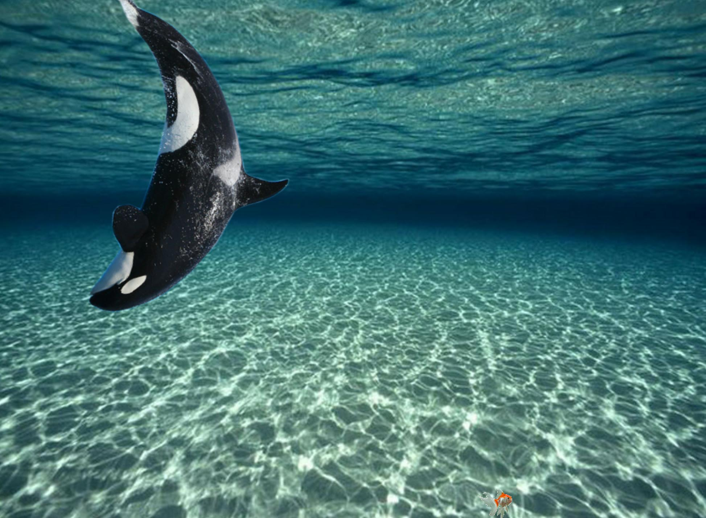
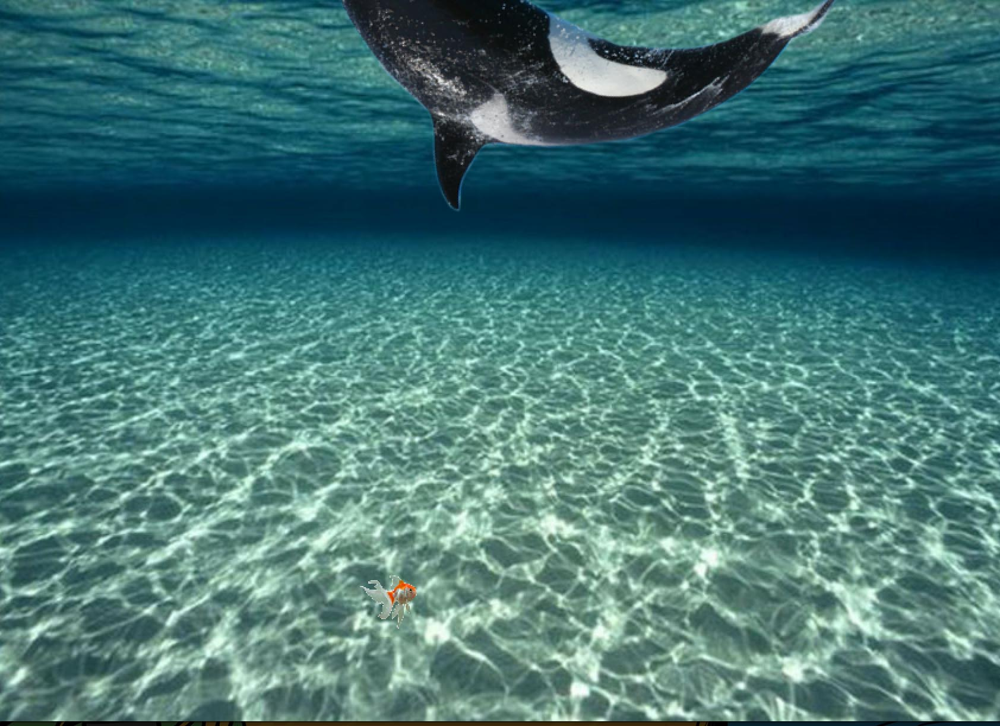

##Underwater Scene
This project generates and animates two images, one of a whale and one of a fish. The whale spins while changing position based on the arrow keys. The fish simply swims to and fro, doing fish things.

The whale is spun according to the x position and multiplied.

  rotate+=abs(move.x*8);
     ofTranslate(pos.x,pos.y) ;
    ofRotate(rotate);
    whale.draw(0,10,10);
    
And is moved around the screen by the arrow keys.

void ofApp::keyPressed(int key){
    if(key==OF_KEY_LEFT) {
        pos.x-=10;
    }
    if(key==OF_KEY_RIGHT) {
        pos.x+=10;
    }
    if(key==OF_KEY_UP) {
        pos.y-=10;
    }
    if(key==OF_KEY_DOWN) {
        pos.y+=10;
    }
    if(key==OF_KEY_HOME) {
        rotate-=abs(move.x*8);
    }
}

The fish is guided by a simple x y axis system.

    if((pos2.x>=ofGetWidth()+50)||(pos2.x<=-50)){
        move2.x*=-1;
    }
    if((pos2.y>=ofGetHeight())||(pos2.y<=ofGetHeight()-ofGetHeight()/4)) {
        move2.y*=-1;
    }
